# Chess LMS Production Architecture Design

Prepared: 2026-06-26

## Executive Recommendation

Build the Chess LMS as a modular monolith first, with explicit domain boundaries, a separate realtime gateway, and queue-backed background workers. This is the best fit because the platform needs strong maintainability, transactional classroom and assignment behavior, and incremental delivery before it needs true microservice autonomy.

The recommended architecture is:

- Frontend: Next.js, TypeScript, Tailwind CSS, PWA.
- Backend API: FastAPI, SQLAlchemy 2.x, Alembic, PostgreSQL.
- Realtime: FastAPI WebSocket service or dedicated ASGI app using Redis Pub/Sub or Redis Streams.
- Workers: Celery with Redis broker initially; use RabbitMQ/SQS later if delivery guarantees become stricter.
- Chess UI: Chessground wrapped behind an internal React board adapter.
- Chess rules: chess.js in the browser, python-chess on the backend, with an internal chess domain wrapper in both places.
- Engine analysis: Stockfish isolated behind an optional engine service, not embedded into the core API process.
- Deployment: Docker Compose for development; containerized production behind a reverse proxy/load balancer.

The design optimizes maintainability first, scalability second, and implementation simplicity third.

## Source Review

The requested open-source repositories were reviewed on GitHub. Key source URLs:

- [Stockfish](https://github.com/official-stockfish/Stockfish)
- [chess.js](https://github.com/jhlywa/chess.js)
- [Chessground](https://github.com/lichess-org/chessground)
- [Lichess lila](https://github.com/lichess-org/lila)
- [python-chess](https://github.com/niklasf/python-chess)
- [Code100x Chess](https://github.com/code100x/chess)
- [OpenChessClub](https://github.com/OpenChessClub/openchessclub)
- [ChessDriller](https://github.com/gtim/chessdriller)

### Repository Reuse Matrix

| Repository | Purpose | Strengths | Weaknesses | Reuse Strategy | Integration Plan |
|---|---|---|---|---|---|
| Stockfish | Strong UCI chess engine for position analysis and best-move search. | Mature, very strong, UCI protocol, widely deployed. | GPL license obligations, CPU-heavy, no GUI, not LMS-specific. | Reuse as an isolated external engine binary/service only when analysis is needed. | Add `engine-service` later. Communicate by UCI through python-chess or a dedicated process manager. Cap CPU/time/depth per request. |
| chess.js | TypeScript chess move generation, validation, FEN/PGN support, game status. | Browser-friendly, typed, BSD-2-Clause, simple API. | Not a UI, not authoritative for backend security, not collaborative-state aware. | Reuse directly through an internal `ChessRulesClient` wrapper. | Use in Next.js for instant legal move validation, previews, homework solving, and board editor validation. |
| Chessground | Lichess board UI for web/mobile with arrows, shapes, drag/drop, touch, FEN import/export. | Excellent interaction model, highly configurable, mobile support, no chess logic. | GPL-3.0-or-later: combined web work may need GPL-compatible source distribution. Low-level API requires careful React integration. | Reuse only if licensing is acceptable. Wrap it so it can be replaced later. | Build `InteractiveChessBoard` adapter. Keep Chessground-specific types out of app domain. Use chess.js/python-chess for rules. |
| Lichess lila | Large-scale open-source chess server. | Battle-tested patterns for realtime chess, separate WebSocket server, Redis communication, modular chess domains. | Scala/Play/Mongo stack differs from requested stack; too large to copy; AGPL licensing. | Study and adapt patterns, not code. | Adopt separate realtime gateway, Redis fanout, immutable move events, studies/analysis-board concepts. |
| python-chess | Python chess library for move validation, PGN, FEN, variants, tablebases, UCI/XBoard engine communication. | Strong backend fit, mature, supports engine communication and formats. | GPL-3.0-or-later, backend CPU work can block if misused, not an LMS model. | Reuse for authoritative backend validation if GPL policy is acceptable; otherwise evaluate alternatives or isolate. | Implement `ChessRulesService` wrapper. Use for FEN validation, legal moves, PGN export/import, homework grading, and Stockfish UCI integration. |
| Code100x Chess | Educational multiplayer chess platform. | Simple monorepo, WebSocket separation, Redis move queue idea. | Not LMS-focused, Node stack differs, likely not production-complete, no release maturity. | Adapt learning from structure, not code. | Reuse conceptual split: frontend, backend, realtime server, Redis event channel. |
| OpenChessClub | Club management app for players, games, events, leaderboards. | Useful club/admin concepts, player profiles, event management. | Small project, Node/Express/Mongo/Handlebars, limited LMS/realtime chess scope. | Adapt product ideas only. | Use as reference for player directories, class rosters, leaderboards, and event list UX. |
| ChessDriller | Opening practice with spaced repetition. | Relevant learning pattern, repertoire/study workflow, self-hosting model. | Svelte stack, depends on Lichess studies, not classroom LMS. | Adapt spaced repetition and opening-drill concepts. | Future `practice` module can reuse its lesson design ideas: due positions, review intervals, repertoire imports. |

### Licensing Risk Decision

| Decision | Why It Exists | Benefits | Limitations | Future Scalability |
|---|---|---|---|---|
| Treat Chessground and python-chess as license-sensitive dependencies. | Chessground and python-chess are GPL-family projects; using them can affect distribution obligations. | Avoids accidental license mismatch before product launch. | May require legal review or source availability strategy. | Wrapper boundary allows replacement if licensing direction changes. |
| Do not copy Lichess, Code100x, OpenChessClub, or ChessDriller code. | Their stacks and licenses do not match this product cleanly. | Keeps architecture coherent and avoids inherited complexity. | Loses some ready-made implementation detail. | Patterns can be adopted without binding the LMS to incompatible internals. |

## Phase 1: Requirements Analysis

### Confirmed Requirements

| Area | Requirement |
|---|---|
| Users | Teachers and students with distinct capabilities. |
| Auth | Login, JWT auth, RBAC, password reset, email verification. |
| Classrooms | Teacher-created classrooms with enrolled students, assignments, schedule, live board, resources. |
| Chessboard | Lichess-like interaction: highlights, colored arrows, multiple arrows, legal validation, drag/drop, touch, coordinates, orientation, board editing, FEN generation. |
| Teacher Controls | Demonstrate positions, assign moves, reset, flip, lock/unlock, create positions. |
| Homework | Create, assign, deadline, submission, review inside platform. |
| Scheduling | Class schedule, dashboard reminders, email exactly 10 minutes before class. |
| Position Database | Categorized positions with FEN, title, description, difficulty, tags. |
| Scale | Thousands of classrooms, tens of thousands of students, simultaneous live sessions. |
| Stack | Next.js, TypeScript, Tailwind, PWA, FastAPI, SQLAlchemy, Alembic, PostgreSQL, WebSockets, Docker. |

### Ambiguities To Clarify

| Ambiguity | Why It Matters | Recommended Default |
|---|---|---|
| Is the product commercial, closed-source, open-source, or school-internal? | Chessground/python-chess licensing affects distribution. | Assume commercial SaaS but require legal review before GPL dependency adoption. |
| Are parents/guardians needed? | Chess products for minors often need consent and communication controls. | Add future `guardian` role and student age/consent fields. |
| Do live classes include video/audio? | This dramatically changes infrastructure. | Keep video out of v1; integrate Zoom/Meet links first. |
| Is homework tactical, free-form, opening repertoire, or teacher-created studies? | Data model differs by assignment type. | Support generic assignment shell plus position-task subtype in v1. |
| Should students play each other in rated games? | Requires matchmaking, clocks, anti-cheat, rating systems. | Out of v1; support classroom board collaboration first. |
| Are reminders email-only or push/SMS too? | Notification channels affect consent, cost, and workers. | Email and in-app initially; PWA push later. |
| Does "exactly 10 minutes" mean best effort or hard SLA? | Email providers cannot guarantee exact inbox delivery. | Schedule send job at T-10m with idempotency; state external delivery as best effort. |

### Assumptions

- One account has one primary role initially: teacher or student.
- Teachers own classrooms; students join by invitation code or teacher invite.
- A classroom live board is collaborative but teacher-authoritative.
- Backend is authoritative for persistence, permissions, and grading.
- Frontend rule checks improve UX but never replace backend validation.
- PostgreSQL is the system of record.
- Redis is added for realtime fanout, rate limiting, cache, and queue broker.
- Email is sent through a provider such as SES, SendGrid, Postmark, or Mailgun.
- Mobile usage is through responsive PWA, not native apps in v1.

### Missing Requirements

| Missing Requirement | Recommendation |
|---|---|
| Tenant model | Decide whether teachers are independent tenants or part of schools/organizations. Add `organization` in schema even if hidden in v1. |
| Age/privacy compliance | Add privacy review for COPPA/GDPR-K if serving minors. |
| Content moderation | Add teacher-controlled resources, safe links, and audit trails. |
| Accessibility | Require WCAG 2.1 AA for core flows and keyboard-accessible board alternatives. |
| Import/export | Plan PGN/FEN import/export for positions and homework. |
| Analytics | Track assignment completion, attendance, and learning progress. |
| Billing | Not requested; keep out of core schema but leave organization boundary. |
| Backups/retention | Add backup, restore, and data-retention policies. |

### Risks

| Risk | Impact | Mitigation |
|---|---|---|
| GPL licensing from Chessground/python-chess/Stockfish | Could force source distribution or block commercial plans. | Legal review; wrapper boundaries; consider permissive alternatives if needed. |
| Realtime state conflicts | Incorrect board state during live class. | Teacher-authoritative events, version numbers, snapshots, idempotent event handling. |
| Email timing guarantee | "Exactly 10 minutes" is not fully controllable after handoff to provider. | Queue at exact target time; expose send status; use provider webhooks. |
| WebSocket scaling | Sticky sessions and fanout complexity. | Stateless WS nodes with Redis pub/sub and room membership. |
| Assignment model too narrow | Hard to add drills, studies, tests, games later. | Polymorphic assignment task model. |
| Minors and privacy | Legal and trust risk. | Minimal data, guardian support, consent fields, audit logs. |

### Recommended Improvements

- Add organization/school support early in schema, even if UI starts with solo teachers.
- Add guardian and consent readiness before launch to youth audiences.
- Treat every board change as an event, not just a mutable FEN update.
- Use a domain-specific internal chess wrapper so chess.js/python-chess can be upgraded or replaced.
- Add feature flags for engine analysis, PWA push, and advanced homework types.
- Add observability from day one: request IDs, structured logs, metrics, traces.

### Architecture Decision Register

| Decision | Why It Exists | Benefits | Limitations | Future Scalability |
|---|---|---|---|---|
| Modular monolith backend | The domains are tightly related and early team velocity matters. | Simpler deployment, simpler transactions, less distributed complexity. | Requires discipline to keep module boundaries clean. | Can extract realtime, notification, and engine modules later. |
| Separate realtime gateway/process | WebSocket workloads behave differently from REST. | Independent scaling, isolates long-lived connections. | Adds Redis/fanout complexity. | Supports many live sessions by scaling WS nodes horizontally. |
| Event-sourced board sessions | Live board state needs synchronization and replay. | Conflict handling, auditability, recovery, late join support. | More complex than storing only latest FEN. | Enables replay, analytics, and collaborative studies. |
| PostgreSQL as source of truth | Relational LMS data has strong integrity requirements. | ACID transactions, constraints, indexes, mature tooling. | Requires care for high-write event tables. | Partition board events and notifications as volume grows. |
| Redis for ephemeral coordination | Realtime rooms, locks, rate limits, and queues need fast shared state. | Fast, proven, simple with FastAPI/Celery. | Redis is not the permanent source of truth. | Can move streams/queues to Kafka/RabbitMQ later if needed. |
| Transactional outbox for reminders | Scheduling needs reliability across DB and worker boundaries. | Prevents lost notifications. | More tables and worker logic. | Scales to email, push, SMS, webhooks. |
| Chess wrappers | Avoid dependency leakage and licensing/upgrade lock-in. | Maintainable boundary, easier testing. | Small upfront abstraction cost. | Allows alternate engines/UI libraries later. |

## Phase 2: High Level Design

### System Context Diagram

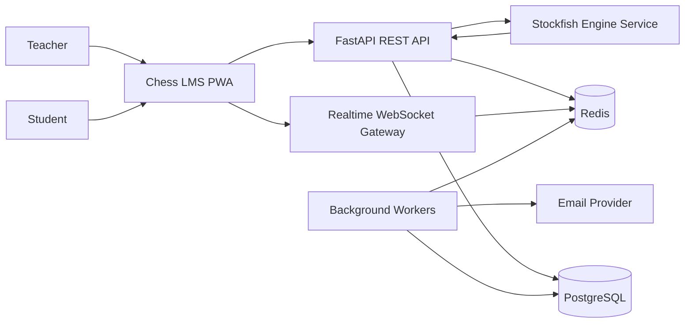

### Container Diagram

| Container | Responsibility | Scaling Unit |
|---|---|---|
| Next.js PWA | UI, routing, board interactions, offline cache, client validation. | CDN/static + server runtime if SSR is used. |
| FastAPI API | Auth, classrooms, assignments, schedules, positions, resources. | Horizontal API replicas. |
| WebSocket Gateway | Live sessions, board events, presence, teacher controls. | Horizontal WS replicas. |
| Worker | Email reminders, password reset email, assignment deadline jobs, outbox dispatch. | Horizontal worker replicas by queue. |
| PostgreSQL | Durable relational data. | Vertical first, read replicas later, partitioning for events. |
| Redis | Pub/Sub/Streams, cache, rate limit, Celery broker. | Managed Redis cluster/sentinel later. |
| Engine Service | Optional Stockfish analysis. | CPU-isolated replicas with per-user quotas. |

### Component Diagram

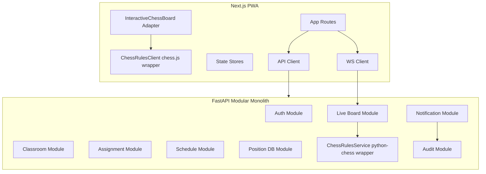

### Deployment Diagram

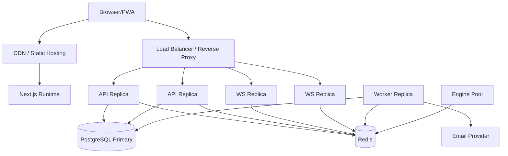

### Request Flow

1. Browser sends REST request with short-lived access token.
2. FastAPI middleware assigns request ID, validates JWT, loads role/permissions.
3. Router validates request body with Pydantic schemas.
4. Service layer applies business rules.
5. Repository layer performs SQLAlchemy operations in one transaction.
6. Audit/outbox records are written in the same transaction where required.
7. Response returns typed JSON and cache headers.
8. Worker asynchronously handles outbox records for notifications.

### Authentication Flow

1. User registers or is invited.
2. Backend creates inactive user and sends verification email.
3. User verifies email with single-use token.
4. Login validates credentials and issues:
   - Access token: short-lived JWT, 5-15 minutes.
   - Refresh token: opaque random token stored hashed server-side and sent in secure HttpOnly cookie.
5. Refresh endpoint rotates refresh token.
6. Logout revokes refresh token family.
7. Password reset invalidates existing refresh sessions after successful reset.

### Realtime Flow

1. Client opens WebSocket with access token.
2. WS gateway validates token and classroom/session membership.
3. Gateway joins Redis-backed room.
4. Teacher sends board command, such as `BOARD_LOCKED` or `POSITION_SET`.
5. Gateway validates permission and session version.
6. Event is persisted to Postgres and published to Redis.
7. All connected students receive event and update local board state.
8. Late joiners load latest snapshot plus recent events.

### Data Flow

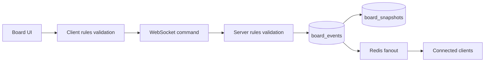

## Phase 3: Technology Justification

### Frontend

| Technology | Why Selected | Alternatives | Trade-offs | Recommendation |
|---|---|---|---|---|
| Next.js | Mature React framework, strong routing, SSR/ISR options, PWA-friendly. | Vite SPA, Remix, SvelteKit. | Next.js adds framework complexity, but improves app structure and deployment options. | Use App Router with clear client/server component boundaries. |
| TypeScript | Reduces UI/domain mismatch, essential for board event contracts. | JavaScript. | More setup and stricter typing. | Required for maintainability. |
| Tailwind CSS | Fast consistent styling, good for dashboards and responsive layouts. | CSS Modules, Chakra, MUI. | Can become noisy if components are not extracted. | Use Tailwind plus small design-system components. |
| PWA | Supports mobile usage, offline review, installability. | Native mobile apps. | Offline live features remain limited. | Use PWA for v1, native later only if needed. |

### Backend

| Technology | Why Selected | Alternatives | Trade-offs | Recommendation |
|---|---|---|---|---|
| FastAPI | Strong typing, async support, OpenAPI generation, Python chess ecosystem. | Django, NestJS, Flask. | Requires assembling auth/admin patterns manually. | Use FastAPI with strict module boundaries. |
| SQLAlchemy | Mature ORM and SQL toolkit, works with Alembic. | Django ORM, Tortoise ORM, raw SQL. | Requires discipline for lazy loading and transaction boundaries. | Use SQLAlchemy 2.x typed models. |
| Alembic | Standard SQLAlchemy migration tool. | Flyway, Liquibase. | Python-specific migration scripts. | Required. |
| PostgreSQL | Strong relational integrity and indexing for LMS data. | MongoDB, MySQL. | Requires schema migrations. | Use as source of truth. |
| Redis | Needed for pub/sub, cache, rate limits, queues. | RabbitMQ, Kafka, in-memory. | Redis Pub/Sub is ephemeral; Streams require trimming/monitoring. | Use Redis initially; keep durable events in Postgres. |
| Celery | Mature worker ecosystem, scheduling support. | RQ, Dramatiq, APScheduler, Temporal. | Celery can be operationally fiddly. | Use Celery for v1; consider Temporal if workflows become complex. |

### Realtime

| Approach | Benefits | Limitations | Recommendation |
|---|---|---|---|
| FastAPI WebSockets in API process | Simple initial deployment. | Long-lived connections can affect API latency. | Acceptable for prototype only. |
| Dedicated FastAPI/ASGI WS gateway | Independent scale and clearer ownership. | More deployment units. | Recommended for production. |
| Managed realtime provider | Less infrastructure. | Vendor lock-in and harder custom authorization. | Not recommended for core classroom board. |

### Chess Stack

| Technology | Why Selected | Alternatives | Recommendation |
|---|---|---|---|
| Chessground | Best match for required Lichess-like UX. | react-chessboard, custom board. | Use only after GPL review; wrap it. |
| chess.js | Best browser rule engine for legal moves and FEN/PGN. | wasm engine, custom logic. | Use via wrapper. |
| python-chess | Best Python backend chess rules and UCI integration. | Custom validator, Stockfish-only validation. | Use via wrapper after license review. |
| Stockfish | Best optional analysis engine. | Cloud engine API, no engine. | Isolate as optional service. |

## Phase 4: Low Level Design

### Backend Module Breakdown

| Module | Responsibilities |
|---|---|
| `auth` | Users, credentials, sessions, JWT, refresh token rotation, email verification, password reset. |
| `rbac` | Roles, permissions, policy checks, classroom membership capabilities. |
| `classrooms` | Classroom lifecycle, enrollment, invitation codes, resources. |
| `assignments` | Homework definitions, tasks, assignment publication, submissions, grading. |
| `schedule` | Class sessions, reminder creation, attendance hooks. |
| `notifications` | Email/in-app notification templates, outbox, delivery status. |
| `positions` | Position database, tags, difficulty, categories, FEN validation. |
| `live_board` | Board sessions, events, snapshots, locks, teacher controls, presence. |
| `chess_engine` | python-chess wrapper, Stockfish adapter, PGN/FEN utilities. |
| `audit` | Security and administrative event logs. |
| `observability` | Logging, metrics, tracing helpers. |

### Proposed Backend Folder Structure

```text
backend/
  app/
    main.py
    core/
      config.py
      security.py
      database.py
      logging.py
      errors.py
      rate_limit.py
    modules/
      auth/
        api.py
        models.py
        schemas.py
        service.py
        repository.py
        tokens.py
      classrooms/
      assignments/
      schedule/
      notifications/
      positions/
      live_board/
      chess_engine/
      audit/
    workers/
      celery_app.py
      reminder_tasks.py
      notification_tasks.py
    realtime/
      gateway.py
      protocol.py
      rooms.py
    migrations/
```

### Layering

| Layer | Why It Exists | Benefits | Limitations | Future Scalability |
|---|---|---|---|---|
| API layer | HTTP and WS boundary. | Keeps validation and response shape explicit. | Can grow large if business logic leaks in. | Version endpoints without changing services. |
| Service layer | Business rules and orchestration. | Testable domain behavior. | Needs discipline to avoid God services. | Extract module to service later if needed. |
| Repository layer | Database access. | Centralized queries, transaction clarity. | Extra boilerplate. | Enables query tuning and read model split. |
| Domain wrappers | Isolate chess/auth/notification dependencies. | Easier upgrades and replacement. | More interfaces. | Supports future engine/provider changes. |

### Database Layer

- Use SQLAlchemy 2.x typed declarative models.
- Use explicit transactions per service command.
- Use optimistic concurrency for live board sessions with `version`.
- Store immutable events for live board actions.
- Use Alembic for all schema changes.
- Use Pydantic response schemas; never return ORM models directly.

### Service Layer

Services should expose use-case methods:

- `AuthService.register_teacher`
- `ClassroomService.create_classroom`
- `AssignmentService.publish_assignment`
- `ScheduleService.schedule_class`
- `LiveBoardService.apply_command`
- `PositionService.create_position`
- `NotificationService.enqueue_reminder`

Each method owns permission checks, validation calls, transaction boundaries, and audit logging triggers.

### Repository Layer

Repositories should be thin:

- Query by primary key.
- Query by owner/member relationship.
- Persist aggregates.
- Apply lock/version checks.
- Avoid business decisions.

### API Layer

REST APIs use:

- `/api/v1/...` prefix.
- JSON request/response bodies.
- Pydantic schemas.
- Standard error envelope.
- Request ID in response headers.
- Pagination for list endpoints.

### Authentication Design

| Decision | Why | Benefits | Limitations | Future Scalability |
|---|---|---|---|---|
| Access JWT + opaque refresh token | JWT is good for short API auth; refresh token needs revocation. | Fast authorization and secure session control. | Token rotation complexity. | Supports multi-device sessions and forced logout. |
| Refresh token in HttpOnly cookie | Reduces XSS token theft. | Strong browser security. | Requires CSRF handling. | Compatible with PWA. |
| Role + resource policy checks | Classroom membership is resource-specific. | Prevents overbroad role permissions. | More policy code. | Supports schools, assistants, guardians later. |

### Scheduler

Recommended scheduling architecture:

1. When a class session is created or updated, write a `scheduled_notifications` row for `class_start_at - 10 minutes`.
2. Use a periodic worker that scans due unsent notifications every 15-30 seconds using `SELECT ... FOR UPDATE SKIP LOCKED`.
3. Dispatch email jobs idempotently with a unique key: `class_reminder:{class_session_id}:{student_id}`.
4. Mark delivery status as queued, sent, failed, or bounced.
5. Use provider webhooks to update final delivery status.

Why this approach exists: Celery ETA jobs alone can be lost or difficult to reschedule reliably across deploys. A database-backed schedule plus worker lock is easier to audit and recover.

Benefits:

- Durable reminder plan.
- Reschedule-safe.
- Auditable.
- Handles worker crashes.

Limitations:

- Email provider delivery time is outside direct control.
- Polling interval means send starts at target time plus small worker latency.

Future scalability:

- Partition scheduled notifications by date.
- Move dispatch to SQS/RabbitMQ.
- Add SMS/push channels without changing class scheduling.

### Notification Service

Notification channels:

- In-app notification.
- Email.
- PWA push in later phase.

Design:

- Template registry with versioned templates.
- Transactional outbox for notification intents.
- Idempotency key for each recipient/event/channel.
- Provider adapters behind an interface.
- Delivery webhooks authenticated and audited.

### Chess Engine Module

Components:

- `ChessRulesService`: authoritative FEN and move validation.
- `FenService`: normalize, validate, and diff FEN.
- `PgnService`: import/export PGN for homework and sessions.
- `EngineAnalysisService`: optional Stockfish adapter.
- `BoardCommandValidator`: checks whether a user may apply a board command.

Wrapper contract:

- Input: current FEN, attempted move or setup command, context.
- Output: accepted/rejected result, next FEN, SAN/UCI move, legal destinations, validation error.

### Assignment Module

Assignment model:

- Assignment shell: title, instructions, classroom, due date, publication state.
- Assignment tasks: polymorphic task records.
- Submission: one per student per assignment.
- Attempt events: moves, answers, timestamps.
- Review: teacher comments, score, status.

Task types:

- `position_move`: student finds a move from a FEN.
- `line_drill`: student completes a move sequence.
- `free_analysis`: student annotates a position.
- `resource_review`: student marks a resource complete.

Why polymorphic tasks: Homework will expand from simple positions to studies, quizzes, games, and opening drills. A generic task table avoids a rewrite.

### Frontend Component Tree

```text
app/
  (auth)/
    login/
    register/
    verify-email/
    reset-password/
  (dashboard)/
    teacher/
      classrooms/
      assignments/
      schedule/
      positions/
    student/
      classrooms/
      homework/
      schedule/
components/
  layout/
  auth/
  classroom/
  board/
    InteractiveChessBoard.tsx
    ChessgroundAdapter.tsx
    BoardToolbar.tsx
    BoardEditorPanel.tsx
    MoveList.tsx
    TeacherControls.tsx
  assignments/
  schedule/
  positions/
lib/
  api/
  realtime/
  chess/
    ChessRulesClient.ts
    fen.ts
    pgn.ts
  auth/
  stores/
```

### State Management

| State Type | Tool | Reason |
|---|---|---|
| Server cache | TanStack Query | Handles REST caching, mutations, invalidation. |
| Auth session | Small auth store + cookies | Minimal global state. |
| Board ephemeral state | Zustand or local reducer | Low-latency interaction state. |
| WebSocket events | Dedicated realtime client | Keeps protocol separate from UI. |
| Forms | React Hook Form + Zod | Validation consistency and performance. |

### Caching Strategy

| Data | Cache Location | TTL/Invalidation |
|---|---|---|
| Position categories/tags | Browser + CDN/API cache | Long TTL; invalidate on admin change. |
| Classroom roster | TanStack Query | Invalidate on enrollment changes. |
| Upcoming schedule | Browser + API cache | Short TTL; invalidate on schedule mutation. |
| Live board state | No HTTP cache; WS snapshot | Version-based updates. |
| Auth permissions | Access token claims + server policy | Refresh on login/role change. |
| Rate limits | Redis | Sliding window or token bucket. |

### Logging

- Structured JSON logs.
- Request ID and trace ID on every API/WS event.
- User ID and classroom ID where safe.
- No passwords, tokens, FEN is allowed but assignment answers may be sensitive until due date.
- Log auth events, permission denials, password reset, token refresh, board lock/unlock, reminder dispatch.

### Error Handling

Standard error envelope:

```text
{
  "error": {
    "code": "CLASSROOM_NOT_FOUND",
    "message": "Classroom not found.",
    "details": {},
    "request_id": "..."
  }
}
```

Error classes:

- Validation error: 422.
- Authentication error: 401.
- Authorization error: 403.
- Not found: 404.
- Conflict/version mismatch: 409.
- Rate limit: 429.
- Unexpected: 500 with generic message.

## Phase 5: Database Design

### ER Diagram

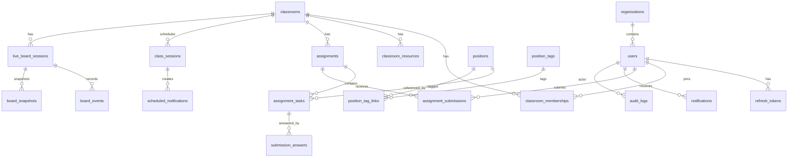

### Core Tables

| Table | Key Fields |
|---|---|
| `organizations` | `id`, `name`, `slug`, `created_at` |
| `users` | `id`, `organization_id`, `email`, `password_hash`, `role`, `display_name`, `email_verified_at`, `status`, `created_at` |
| `refresh_tokens` | `id`, `user_id`, `token_hash`, `family_id`, `expires_at`, `revoked_at`, `created_at` |
| `classrooms` | `id`, `organization_id`, `teacher_id`, `name`, `description`, `join_code_hash`, `status`, `created_at` |
| `classroom_memberships` | `id`, `classroom_id`, `user_id`, `role`, `status`, `joined_at` |
| `classroom_resources` | `id`, `classroom_id`, `title`, `type`, `url`, `metadata`, `created_by` |
| `class_sessions` | `id`, `classroom_id`, `teacher_id`, `starts_at`, `ends_at`, `timezone`, `title`, `meeting_url`, `status` |
| `assignments` | `id`, `classroom_id`, `created_by`, `title`, `instructions`, `due_at`, `status`, `published_at` |
| `assignment_tasks` | `id`, `assignment_id`, `type`, `position_id`, `prompt`, `expected_answer`, `order_index`, `config` |
| `assignment_submissions` | `id`, `assignment_id`, `student_id`, `status`, `submitted_at`, `score`, `reviewed_by`, `reviewed_at` |
| `submission_answers` | `id`, `submission_id`, `task_id`, `answer`, `is_correct`, `feedback`, `answered_at` |
| `positions` | `id`, `created_by`, `fen`, `title`, `description`, `difficulty`, `category`, `metadata`, `created_at` |
| `position_tags` | `id`, `name`, `slug` |
| `position_tag_links` | `position_id`, `tag_id` |
| `live_board_sessions` | `id`, `classroom_id`, `class_session_id`, `current_fen`, `orientation`, `locked`, `version`, `created_by` |
| `board_events` | `id`, `session_id`, `version`, `actor_id`, `event_type`, `payload`, `fen_after`, `created_at` |
| `board_snapshots` | `id`, `session_id`, `version`, `fen`, `state`, `created_at` |
| `scheduled_notifications` | `id`, `recipient_id`, `class_session_id`, `channel`, `send_at`, `status`, `idempotency_key`, `sent_at` |
| `notifications` | `id`, `recipient_id`, `type`, `title`, `body`, `read_at`, `created_at` |
| `audit_logs` | `id`, `actor_id`, `action`, `resource_type`, `resource_id`, `metadata`, `ip_hash`, `created_at` |

### Relationships

- `users.organization_id` is nullable only if solo teachers are allowed outside schools.
- `classrooms.teacher_id` references the owning teacher.
- A student joins a classroom through `classroom_memberships`.
- An assignment belongs to exactly one classroom.
- A submission belongs to one assignment and one student.
- A live board session belongs to a classroom and optionally to a scheduled class session.
- Board events are append-only.

### Indexes

| Table | Index | Why |
|---|---|---|
| `users` | unique lower email | Login lookup and duplicate prevention. |
| `classrooms` | `(teacher_id, status)` | Teacher dashboard. |
| `classroom_memberships` | unique `(classroom_id, user_id)` | Prevent duplicate enrollment. |
| `assignments` | `(classroom_id, due_at)` | Classroom assignment list. |
| `assignment_submissions` | unique `(assignment_id, student_id)` | One active submission per student. |
| `positions` | GIN on tags/search vector | Position search. |
| `positions` | `(difficulty, category)` | Browse filters. |
| `board_events` | unique `(session_id, version)` | Ordered event stream. |
| `board_events` | `(session_id, created_at)` | Replay and audit. |
| `scheduled_notifications` | `(status, send_at)` | Worker due scan. |
| `scheduled_notifications` | unique `idempotency_key` | Duplicate prevention. |
| `audit_logs` | `(actor_id, created_at)` | Security review. |

### Normalization

- Keep users, classrooms, assignments, submissions normalized.
- Use JSONB only for flexible task configuration, board event payloads, and provider metadata.
- Avoid embedding rosters or assignment submissions inside classroom JSON.
- Add generated/search columns for position search if needed.

### Migration Strategy

- Every schema change through Alembic.
- Backward-compatible migrations for deployed services:
  1. Add nullable columns/tables.
  2. Backfill in worker or migration.
  3. Deploy code using new columns.
  4. Add constraints in later migration.
- Use migration tests against a copy of production-like schema.
- Keep seed data for local categories/tags.

## Phase 6: REST API Design

### API Conventions

- Base path: `/api/v1`.
- Auth: Bearer access token except login/register/verification/reset initiation.
- Pagination: `limit`, `cursor`.
- Dates: ISO 8601 UTC.
- Validation: Pydantic schemas; reject unknown dangerous fields.
- Error codes: stable machine-readable strings.

### Authentication Endpoints

| Method | Endpoint | Request | Response | Auth | Validation | Errors |
|---|---|---|---|---|---|---|
| POST | `/auth/register/teacher` | email, password, display_name | user, verification_required | Public | strong password, email format | 409, 422 |
| POST | `/auth/register/student` | email, password, display_name, optional invite_code | user, verification_required | Public | password, invite validity | 409, 422 |
| POST | `/auth/login` | email, password | access_token, user | Public | credentials | 401, 403, 429 |
| POST | `/auth/refresh` | cookie refresh token | access_token | Refresh cookie | token valid | 401, 403 |
| POST | `/auth/logout` | none | success | User | current session | 401 |
| POST | `/auth/logout-all` | none | success | User | active user | 401 |
| POST | `/auth/verify-email` | token | success | Public | token unused/unexpired | 400, 410 |
| POST | `/auth/resend-verification` | email | success | Public | rate limited | 429 |
| POST | `/auth/password-reset/request` | email | success | Public | rate limited | 429 |
| POST | `/auth/password-reset/confirm` | token, new_password | success | Public | token, password | 400, 410, 422 |
| GET | `/auth/me` | none | user, permissions | User | token valid | 401 |

### Classroom Endpoints

| Method | Endpoint | Request | Response | Auth | Validation | Errors |
|---|---|---|---|---|---|---|
| POST | `/classrooms` | name, description | classroom | Teacher | required name | 403, 422 |
| GET | `/classrooms` | cursor, limit | classrooms | User | membership/owner filter | 401 |
| GET | `/classrooms/{id}` | none | classroom detail | Member | membership | 403, 404 |
| PATCH | `/classrooms/{id}` | name, description, status | classroom | Teacher owner | ownership | 403, 404 |
| DELETE | `/classrooms/{id}` | none | archived | Teacher owner | no hard delete | 403, 404 |
| POST | `/classrooms/{id}/join-code` | rotate boolean | join_code | Teacher owner | ownership | 403 |
| POST | `/classrooms/join` | join_code | membership | Student | valid code | 400, 403, 409 |
| GET | `/classrooms/{id}/students` | cursor, limit | students | Teacher/member limited | membership | 403, 404 |
| POST | `/classrooms/{id}/students/invite` | emails | invitations | Teacher owner | email list | 403, 422 |
| DELETE | `/classrooms/{id}/students/{student_id}` | none | removed | Teacher owner | cannot remove teacher | 403, 404 |

### Resource Endpoints

| Method | Endpoint | Request | Response | Auth | Validation | Errors |
|---|---|---|---|---|---|---|
| POST | `/classrooms/{id}/resources` | title, type, url/metadata | resource | Teacher owner | safe URL, type | 403, 422 |
| GET | `/classrooms/{id}/resources` | none | resources | Member | membership | 403 |
| PATCH | `/resources/{resource_id}` | title, metadata | resource | Teacher owner | ownership | 403, 404 |
| DELETE | `/resources/{resource_id}` | none | deleted | Teacher owner | ownership | 403, 404 |

### Assignment Endpoints

| Method | Endpoint | Request | Response | Auth | Validation | Errors |
|---|---|---|---|---|---|---|
| POST | `/classrooms/{id}/assignments` | title, instructions, due_at, tasks | assignment | Teacher owner | due_at, tasks | 403, 422 |
| GET | `/classrooms/{id}/assignments` | status, cursor | assignments | Member | membership | 403 |
| GET | `/assignments/{id}` | none | assignment detail | Member | classroom membership | 403, 404 |
| PATCH | `/assignments/{id}` | fields | assignment | Teacher owner | draft or allowed edit | 403, 409 |
| POST | `/assignments/{id}/publish` | none | assignment | Teacher owner | has tasks | 403, 409 |
| POST | `/assignments/{id}/close` | none | assignment | Teacher owner | published | 403, 409 |
| DELETE | `/assignments/{id}` | none | archived | Teacher owner | no submissions or archive | 403, 409 |
| POST | `/assignments/{id}/submit` | answers | submission | Student member | due date, task answers | 403, 409, 422 |
| GET | `/assignments/{id}/submissions` | cursor | submissions | Teacher owner | ownership | 403 |
| GET | `/assignments/{id}/submission` | none | own submission | Student member | membership | 403, 404 |
| PATCH | `/submissions/{id}/review` | score, feedback, status | reviewed submission | Teacher owner | score bounds | 403, 422 |

### Schedule Endpoints

| Method | Endpoint | Request | Response | Auth | Validation | Errors |
|---|---|---|---|---|---|---|
| POST | `/classrooms/{id}/sessions` | title, starts_at, ends_at, timezone, meeting_url | class_session | Teacher owner | time order, URL | 403, 422 |
| GET | `/classrooms/{id}/sessions` | from, to | sessions | Member | date range | 403 |
| GET | `/sessions/upcoming` | from, to | sessions | User | own memberships | 401 |
| PATCH | `/sessions/{id}` | fields | session | Teacher owner | reschedule reminders | 403, 409 |
| DELETE | `/sessions/{id}` | none | cancelled | Teacher owner | future or allowed | 403, 409 |
| POST | `/sessions/{id}/attendance` | status | attendance | Teacher owner | enrolled student | 403, 422 |

### Position Database Endpoints

| Method | Endpoint | Request | Response | Auth | Validation | Errors |
|---|---|---|---|---|---|---|
| POST | `/positions` | fen, title, description, difficulty, category, tags | position | Teacher | valid FEN | 403, 422 |
| GET | `/positions` | search, difficulty, category, tags, cursor | positions | User | filter bounds | 401 |
| GET | `/positions/{id}` | none | position | User | visibility | 403, 404 |
| PATCH | `/positions/{id}` | fields | position | Owner/admin | FEN if changed | 403, 422 |
| DELETE | `/positions/{id}` | none | archived | Owner/admin | not used or archive | 403, 409 |
| GET | `/position-tags` | none | tags | User | none | 401 |
| POST | `/positions/validate-fen` | fen | normalized_fen, legal, metadata | User | FEN syntax | 422 |

### Live Board REST Endpoints

REST is used for session lifecycle and snapshots; WebSocket is used for live commands.

| Method | Endpoint | Request | Response | Auth | Validation | Errors |
|---|---|---|---|---|---|---|
| POST | `/classrooms/{id}/live-board` | initial_fen, orientation | board_session | Teacher owner | valid FEN | 403, 422 |
| GET | `/live-board/{session_id}` | none | board state, latest events | Member | membership | 403, 404 |
| POST | `/live-board/{session_id}/snapshot` | none | snapshot | Teacher owner | session active | 403, 409 |
| GET | `/live-board/{session_id}/events` | after_version | events | Member | membership | 403 |
| POST | `/live-board/{session_id}/reset` | initial_fen | board state | Teacher owner | valid FEN | 403, 422 |

### Notification Endpoints

| Method | Endpoint | Request | Response | Auth | Validation | Errors |
|---|---|---|---|---|---|---|
| GET | `/notifications` | unread_only, cursor | notifications | User | own only | 401 |
| PATCH | `/notifications/{id}/read` | none | notification | User | own only | 403, 404 |
| PATCH | `/notifications/read-all` | none | count | User | own only | 401 |
| GET | `/notification-preferences` | none | preferences | User | own only | 401 |
| PATCH | `/notification-preferences` | channel settings | preferences | User | valid channels | 422 |

### Admin/Audit Endpoints

| Method | Endpoint | Request | Response | Auth | Validation | Errors |
|---|---|---|---|---|---|---|
| GET | `/audit-logs` | actor_id, resource, from, to, cursor | logs | Admin/teacher scoped | scope | 403 |
| GET | `/health` | none | status | Public/internal | none | 500 |
| GET | `/ready` | none | dependency status | Internal | none | 503 |

## Phase 7: Realtime Design

### WebSocket Architecture

Endpoint:

- `/ws/v1/live-board/{session_id}`

Connection requirements:

- Access token in `Sec-WebSocket-Protocol` or signed short-lived WS ticket.
- Membership check before joining room.
- Server assigns connection ID and sends initial snapshot.

### Message Types

Client to server:

| Type | Sent By | Payload |
|---|---|---|
| `PING` | Any | timestamp |
| `MOVE_ATTEMPT` | Allowed student/teacher | from, to, promotion, expected_version |
| `SET_POSITION` | Teacher | fen, expected_version |
| `RESET_BOARD` | Teacher | fen, expected_version |
| `LOCK_BOARD` | Teacher | locked, expected_version |
| `FLIP_BOARD` | Teacher | orientation, expected_version |
| `DRAW_SHAPE` | Teacher or allowed student | shape data, expected_version |
| `CLEAR_SHAPES` | Teacher | expected_version |
| `SET_ALLOWED_ACTIONS` | Teacher | policy |
| `REQUEST_SYNC` | Any | last_seen_version |

Server to client:

| Type | Payload |
|---|---|
| `WELCOME` | session_id, version, state, permissions |
| `BOARD_EVENT` | version, event_type, payload, fen_after |
| `BOARD_REJECTED` | reason, current_version |
| `PRESENCE_UPDATED` | participants |
| `SYNC_REQUIRED` | latest_snapshot_url or state |
| `ERROR` | code, message |
| `PONG` | timestamp |

### Connection Lifecycle

1. Client requests WS ticket from REST API or connects with access token.
2. WS gateway authenticates and authorizes.
3. Gateway loads board session snapshot.
4. Gateway subscribes to Redis room.
5. Gateway sends `WELCOME`.
6. Client sends commands with `expected_version`.
7. Gateway validates, persists event, publishes to Redis.
8. Gateway heartbeats every 25-30 seconds.
9. On disconnect, presence is updated with a short grace period.

### Synchronization

- Every board event increments session `version`.
- Clients include `expected_version`.
- If client version is stale:
  - For teacher commands: reject with `SYNC_REQUIRED`.
  - For student moves: reject and send current legal state.
- Snapshots are created every N events or every M minutes.
- Late joiners receive latest snapshot and events after snapshot version.

### Conflict Resolution

| Conflict | Resolution |
|---|---|
| Two students move simultaneously | Teacher policy decides. Default: only first event at expected version is accepted. |
| Teacher changes position while student moves | Teacher command wins if persisted first; stale student move rejected. |
| Student draws annotation while board changes | Shapes are versioned; stale shapes may be kept if configured or cleared on position change. |
| Network reconnect | Client requests sync from last seen version. |
| Duplicate command | Idempotency key prevents double-apply. |

### Scaling Strategy

- WS nodes are stateless except local connections.
- Redis Pub/Sub fans events to all nodes.
- Postgres stores durable board events.
- Load balancer supports WebSocket upgrade.
- Sticky sessions are optional, not required.
- Rate limit per user/session command rate in Redis.
- For very high volume, move board event fanout to Redis Streams or Kafka and partition by `session_id`.

## Phase 8: Architecture Diagrams

### System Architecture

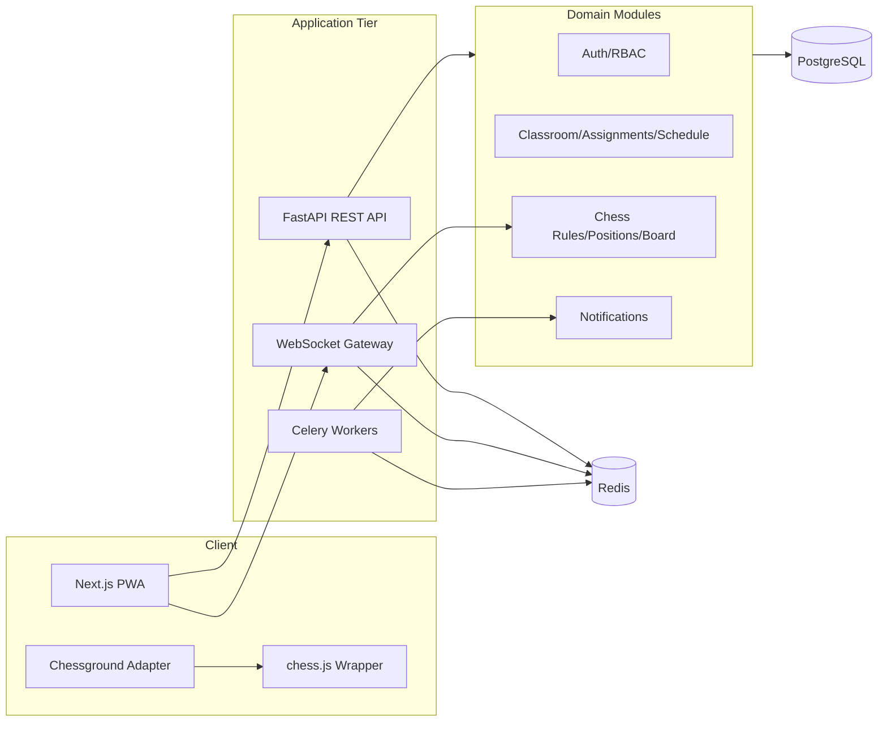

### Deployment

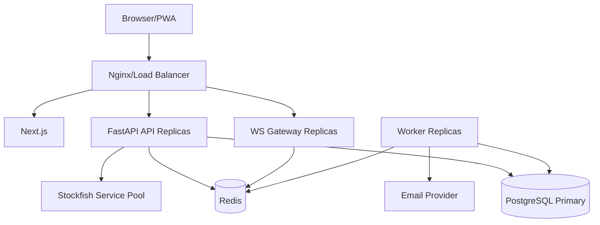

### Authentication Flow

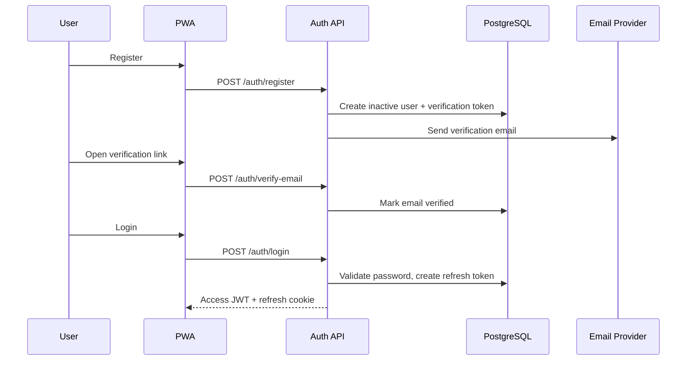

### Live Board Sequence

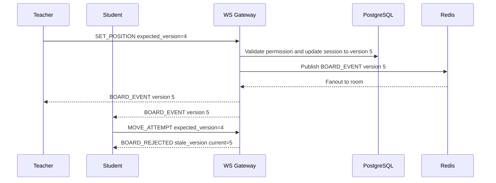

### Reminder Sequence

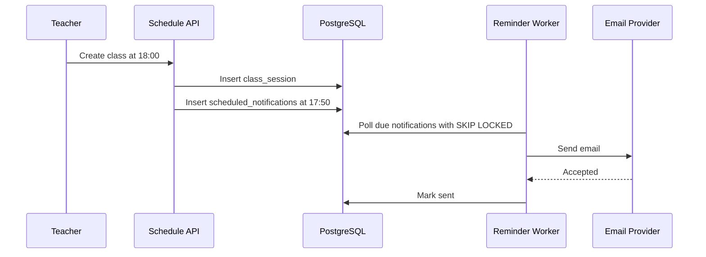

### Component Diagram

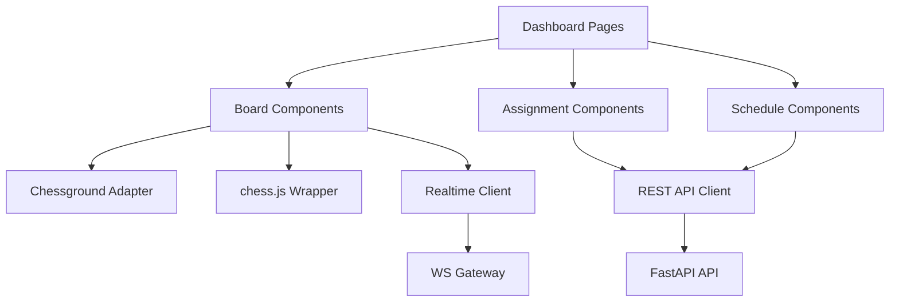

### Database Relationships

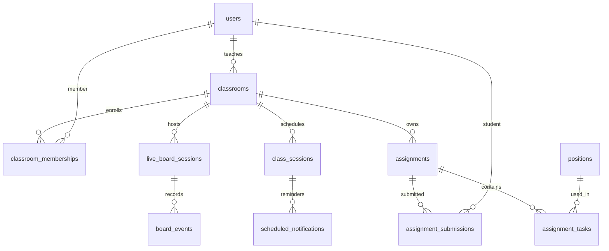

## Phase 9: Docker Design

### Development Environment

Services:

- `frontend`: Next.js dev server.
- `api`: FastAPI with reload.
- `ws`: WebSocket gateway with reload.
- `worker`: Celery worker.
- `beat` or `scheduler`: periodic due-notification scanner.
- `postgres`: local PostgreSQL.
- `redis`: local Redis.
- `mailhog` or equivalent: local email capture.
- `engine`: optional Stockfish service.

### Production Environment

Services:

- `frontend` container or static deployment via CDN.
- `api` container running Gunicorn/Uvicorn workers.
- `ws` container running ASGI WebSocket service.
- `worker` containers by queue: `notifications`, `default`, `engine`.
- Managed PostgreSQL preferred.
- Managed Redis preferred.
- Reverse proxy/load balancer terminates TLS.

### Dockerfile Strategy

| Dockerfile | Design |
|---|---|
| `frontend/Dockerfile` | Multi-stage Node build, install dependencies, build Next.js, run minimal production server or export static assets where possible. |
| `backend/Dockerfile` | Python slim base, install locked dependencies, non-root user, run API or worker by command. |
| `engine/Dockerfile` | Optional Stockfish binary/image, CPU limits, no network except internal API if possible. |

### Docker Compose Files

| File | Purpose |
|---|---|
| `docker-compose.yml` | Shared service definitions. |
| `docker-compose.dev.yml` | Bind mounts, hot reload, Mailhog, local credentials. |
| `docker-compose.prod.yml` | Production-like images, no bind mounts, health checks. |
| `.env.example` | Safe defaults and documented variables. |
| `.env.development` | Local development values, not committed if sensitive. |
| `.env.production.example` | Production variable names only, no secrets. |

### Environment Variables

Required categories:

- Database: `DATABASE_URL`.
- Redis: `REDIS_URL`.
- Auth: `JWT_ISSUER`, `JWT_AUDIENCE`, `ACCESS_TOKEN_TTL_SECONDS`, `REFRESH_TOKEN_TTL_DAYS`.
- Secrets: `JWT_PRIVATE_KEY`, `JWT_PUBLIC_KEY`, `PASSWORD_PEPPER`.
- Email: `EMAIL_PROVIDER`, `EMAIL_API_KEY`, `EMAIL_FROM`.
- Frontend: `NEXT_PUBLIC_API_BASE_URL`, `NEXT_PUBLIC_WS_BASE_URL`.
- Security: `CORS_ALLOWED_ORIGINS`, `COOKIE_DOMAIN`, `CSRF_SECRET`.

### Secrets Management

| Environment | Strategy |
|---|---|
| Local | `.env.development`, never real production secrets. |
| CI | CI secret store. |
| Production | Cloud secret manager or orchestrator secrets. |

Do not bake secrets into images. Do not commit `.env` files with real credentials.

## Phase 10: Progressive Web App

### Offline Strategy

| Feature | Offline Behavior |
|---|---|
| Dashboard shell | Available offline after first load. |
| Position database | Cache recently viewed positions. |
| Homework | Allow draft answers offline when assignment content is cached. Sync when online. |
| Live class board | Online-only with clear disconnected state. |
| Schedule | Cache upcoming sessions and reminders locally. |

### Caching Strategy

- Use service worker through Workbox or Next.js PWA tooling.
- Cache static assets with revisioned filenames.
- Cache GET API responses selectively:
  - positions,
  - upcoming schedule,
  - classroom metadata,
  - assignment content.
- Do not cache auth responses, refresh tokens, or sensitive submission reviews.
- Use background sync for homework draft submissions only if conflict rules are clear.

### Manifest

Manifest fields:

- `name`: Chess LMS.
- `short_name`: Chess LMS.
- `start_url`: `/`.
- `display`: `standalone`.
- `theme_color`: product design token.
- `background_color`: product design token.
- Icons: 192, 512, maskable variants.

### Installability

Requirements:

- HTTPS in production.
- Valid manifest.
- Service worker.
- Responsive layout.
- Offline fallback page.

### Push Notifications

Use in later milestone:

- VAPID keys for web push.
- User opt-in per device.
- Notification preferences by channel.
- Push reminders for classes and deadlines.
- Email remains primary for T-10 class reminder until push delivery reliability is proven.

## Phase 11: Testing Strategy

### Unit Tests

| Area | Tests |
|---|---|
| Auth | Password hashing, token rotation, invalid token reuse, permission policies. |
| Chess wrappers | FEN validation, legal moves, illegal moves, checkmate/stalemate, PGN export. |
| Assignment | Due date handling, grading, submission status. |
| Scheduler | Reminder time calculation, idempotency, reschedule behavior. |
| Board protocol | Version conflicts, teacher lock, student permissions. |

### Integration Tests

- API route tests with test PostgreSQL.
- Alembic migration up/down or forward-only validation.
- Worker tests with Redis and test email provider.
- WebSocket tests for connect, join, publish, reconnect.
- Outbox tests for crash/retry behavior.

### E2E Tests

Use Playwright:

- Teacher registers, verifies email, creates classroom.
- Student joins classroom.
- Teacher creates live board and locks/unlocks board.
- Student attempts legal and illegal moves.
- Teacher creates homework; student submits; teacher reviews.
- Teacher schedules class; reminder is created.
- PWA install/offline smoke test.

### Manual Testing

- Touch board on mobile devices.
- Right-click highlights and arrows on desktop.
- Board orientation and coordinate visibility.
- Screen reader and keyboard alternatives.
- Email templates across clients.
- Slow network and reconnect behavior.

### Acceptance Criteria

| Feature | Acceptance Criteria |
|---|---|
| Auth | Users can register, verify, log in, refresh, reset password; revoked refresh tokens cannot be reused. |
| Classroom | Teacher can create a classroom; student can join; unauthorized users cannot view it. |
| Board | Supports legal moves, arrows, highlights, drag/drop, touch, orientation, editor, FEN generation. |
| Teacher controls | Lock/unlock/reset/flip/set-position are applied to all students in realtime. |
| Homework | Teacher creates assignment; student submits; teacher reviews. |
| Scheduling | Class reminder records are generated at T-10m and sent idempotently. |
| Observability | API, WS, and workers emit structured logs and metrics. |

## Phase 12: Development Roadmap

Each milestone is independently testable and should leave the system in a working state.

### Milestone 1: Project Skeleton

| Field | Detail |
|---|---|
| Objective | Create repo structure, local Docker Compose, health endpoints, frontend shell. |
| Files Created | `frontend/`, `backend/`, `docker-compose.yml`, `.env.example`, README. |
| Files Modified | None initially. |
| Dependencies | Node, Python, PostgreSQL, Redis. |
| Expected Output | Local frontend and API start; `/health` returns OK. |
| How to Test | Run compose; open frontend; call health endpoint. |
| Definition of Done | All services start locally with documented commands. |

### Milestone 2: Database and Migrations

| Field | Detail |
|---|---|
| Objective | Add SQLAlchemy, Alembic, base models for users and organizations. |
| Files Created | DB config, base model, first migration. |
| Files Modified | Backend app setup. |
| Dependencies | Milestone 1. |
| Expected Output | Database schema migrates cleanly. |
| How to Test | Run migration in empty DB and test DB. |
| Definition of Done | Migration is repeatable and documented. |

### Milestone 3: Authentication Foundation

| Field | Detail |
|---|---|
| Objective | Register, login, access JWT, refresh token, logout. |
| Files Created | `auth` module models/schemas/service/API. |
| Files Modified | App router, config, tests. |
| Dependencies | Milestone 2. |
| Expected Output | User can authenticate and receive tokens. |
| How to Test | API tests for happy path and invalid credentials. |
| Definition of Done | Token rotation and logout tests pass. |

### Milestone 4: Email Verification and Password Reset

| Field | Detail |
|---|---|
| Objective | Add email verification and password reset using local email capture. |
| Files Created | Notification template basics, token tables. |
| Files Modified | Auth flows. |
| Dependencies | Milestone 3. |
| Expected Output | Verification/reset emails are captured locally. |
| How to Test | Register user and verify through token endpoint. |
| Definition of Done | Tokens expire, cannot be reused, and are rate limited. |

### Milestone 5: Classroom Core

| Field | Detail |
|---|---|
| Objective | Teachers create classrooms; students join via code. |
| Files Created | `classrooms` module. |
| Files Modified | RBAC policies. |
| Dependencies | Milestone 3. |
| Expected Output | Teacher/student dashboard shows classrooms. |
| How to Test | Teacher creates class, student joins, unauthorized access denied. |
| Definition of Done | Membership constraints and permissions are tested. |

### Milestone 6: Position Database

| Field | Detail |
|---|---|
| Objective | CRUD positions, validate FEN, tag/filter positions. |
| Files Created | `positions` module, chess backend wrapper. |
| Files Modified | Migrations, frontend position pages. |
| Dependencies | Milestone 5. |
| Expected Output | Teacher can create and browse positions. |
| How to Test | Submit valid/invalid FEN; filter by difficulty/category/tag. |
| Definition of Done | Backend validation and search tests pass. |

### Milestone 7: Chessboard UI Adapter

| Field | Detail |
|---|---|
| Objective | Integrate Chessground behind React adapter with chess.js validation. |
| Files Created | `InteractiveChessBoard`, `ChessgroundAdapter`, `ChessRulesClient`. |
| Files Modified | Classroom board page. |
| Dependencies | Milestone 6 and licensing approval. |
| Expected Output | Board supports drag/drop, touch, arrows, highlights, FEN generation. |
| How to Test | Component tests and manual desktop/mobile board QA. |
| Definition of Done | Board features match mandatory interaction list. |

### Milestone 8: Live Board Realtime

| Field | Detail |
|---|---|
| Objective | WebSocket session, board events, teacher lock/unlock/reset/flip. |
| Files Created | `live_board` module, WS gateway, protocol types. |
| Files Modified | Board page, Docker Compose. |
| Dependencies | Milestone 7. |
| Expected Output | Teacher changes propagate to connected students. |
| How to Test | Multi-browser Playwright test with teacher and student. |
| Definition of Done | Version conflicts and reconnect sync are tested. |

### Milestone 9: Homework MVP

| Field | Detail |
|---|---|
| Objective | Create assignment with position tasks; student submits; teacher reviews. |
| Files Created | `assignments` module and frontend pages. |
| Files Modified | Position picker, classroom dashboard. |
| Dependencies | Milestone 6. |
| Expected Output | End-to-end homework workflow works. |
| How to Test | E2E test from teacher assignment to review. |
| Definition of Done | Due date and permission edge cases are tested. |

### Milestone 10: Scheduling MVP

| Field | Detail |
|---|---|
| Objective | Teachers schedule classes; students see upcoming sessions. |
| Files Created | `schedule` module, schedule UI. |
| Files Modified | Classroom dashboard. |
| Dependencies | Milestone 5. |
| Expected Output | Upcoming class list appears for teachers/students. |
| How to Test | Create, update, cancel class session. |
| Definition of Done | Timezone and date-range tests pass. |

### Milestone 11: Reminder Worker

| Field | Detail |
|---|---|
| Objective | Send email reminders at class start minus 10 minutes. |
| Files Created | Worker app, scheduled notification tables, email provider adapter. |
| Files Modified | Schedule service. |
| Dependencies | Milestone 10. |
| Expected Output | Reminder job is enqueued and sent idempotently. |
| How to Test | Create class 11 minutes ahead; verify email captured at due time. |
| Definition of Done | Retry, duplicate prevention, reschedule behavior tested. |

### Milestone 12: PWA Offline Shell

| Field | Detail |
|---|---|
| Objective | Add manifest, service worker, offline shell, cached schedule/positions. |
| Files Created | Manifest, service worker config, icons. |
| Files Modified | Next.js config. |
| Dependencies | Milestones 6 and 10. |
| Expected Output | App is installable and basic cached pages work offline. |
| How to Test | Lighthouse PWA audit and offline browser test. |
| Definition of Done | Installability and offline fallback pass. |

### Milestone 13: Observability and Security Hardening

| Field | Detail |
|---|---|
| Objective | Structured logs, metrics, rate limits, audit log, security headers. |
| Files Created | Observability module, audit module, middleware. |
| Files Modified | API/WS config. |
| Dependencies | Core modules. |
| Expected Output | Request logs, audit events, and metrics are available. |
| How to Test | Trigger auth/board events; verify logs and rate limits. |
| Definition of Done | Security checklist passes. |

### Milestone 14: Production Deployment Readiness

| Field | Detail |
|---|---|
| Objective | Production Docker images, env strategy, CI checks, backup plan. |
| Files Created | Production compose/k8s-ready docs, CI workflow. |
| Files Modified | Dockerfiles, deployment docs. |
| Dependencies | Previous milestones. |
| Expected Output | Staging deployment is reproducible. |
| How to Test | Deploy staging, run smoke and E2E tests. |
| Definition of Done | Rollback, migration, and backup procedures documented and tested. |

### Milestone 15: Optional Engine Analysis

| Field | Detail |
|---|---|
| Objective | Add Stockfish-backed analysis with quotas. |
| Files Created | Engine service, analysis API, worker queue. |
| Files Modified | Board/position UI. |
| Dependencies | Milestone 6 and license/legal approval. |
| Expected Output | Teacher can request bounded engine analysis for a position. |
| How to Test | Analyze FEN with depth/time limits and verify timeout handling. |
| Definition of Done | CPU limits, queue limits, and abuse protections are tested. |

## Final Recommendation

Proceed with the modular monolith plus separate realtime gateway. Build the chess interaction behind wrappers from day one. Treat licensing as a phase-zero gate before committing to Chessground, python-chess, and Stockfish in a commercial deployment.

The first implementation slice should be:

1. Auth.
2. Classroom membership.
3. Position database.
4. Board adapter.
5. Live board events.
6. Homework MVP.
7. Scheduling and reminders.

This path validates the hardest product risks early: permissions, chessboard UX, realtime synchronization, and reliable class reminders.
